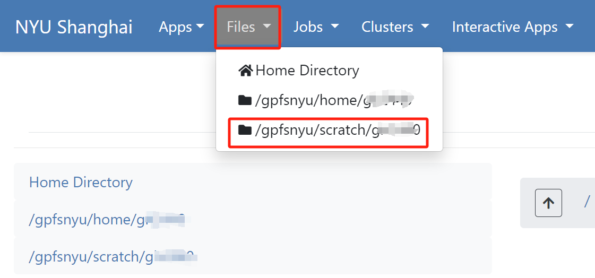
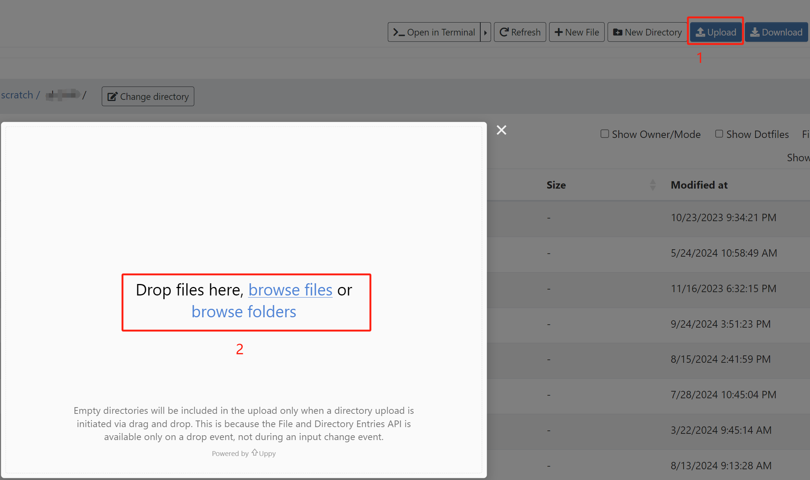
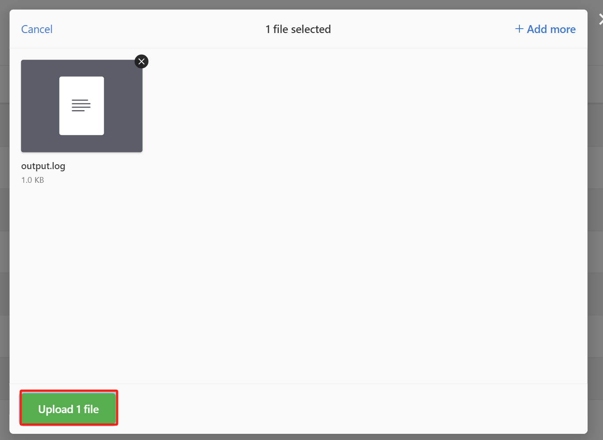
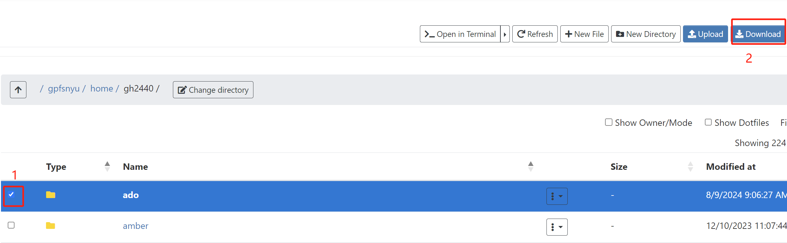

# File Transfers by Open OnDemand

Login to the [Open OnDemand (OOD)](https://ood.shanghai.nyu.edu) portal web server.

## Upload Files
1.Choose the Target Directory
{: style="width:90%;" .center}

2.Choose Files
{: style="width:90%;" .center}

3.Upload
{: style="width:90%;" .center}

## Download Files

1.Choose the Target Directory
{: style="width:90%;" .center}

2.Download
{: style="width:90%;" .center}
