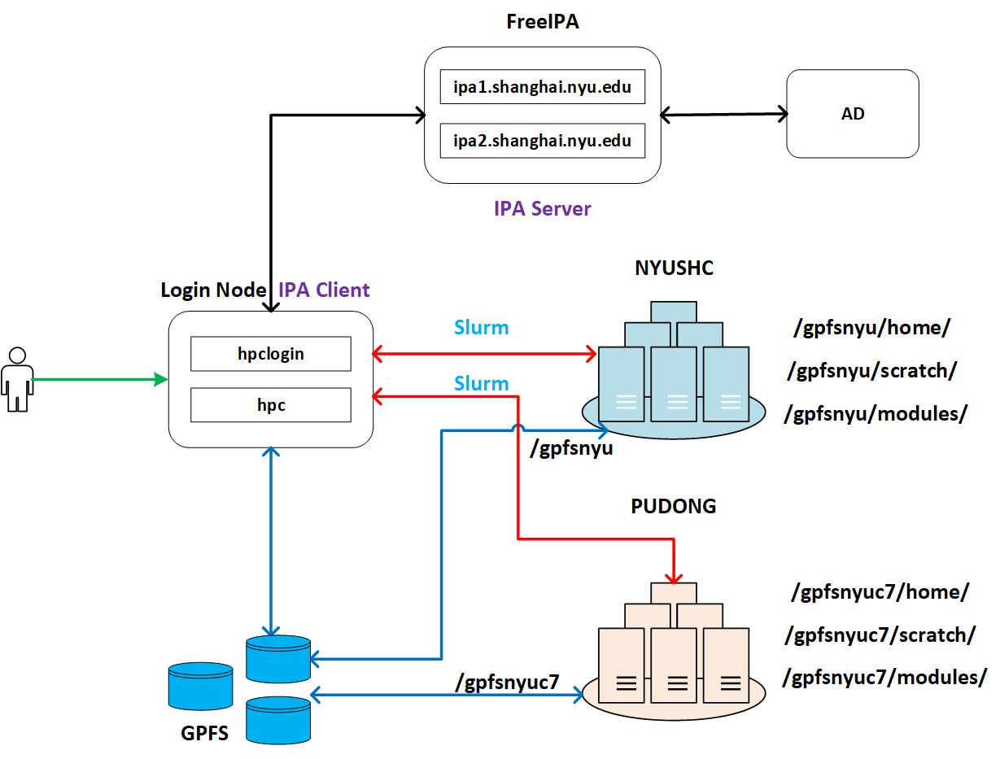

# Overview
**NYUSH HPC Cluster** consists of two clusters, which can be accessed via the campus network.

- nyushc
- pudong (do not support utill July 1, 2025)

**Total**

| Classes | Nodes | CPUs | GPUs  |
|:--------|:------|:-----|:-----:|
| `Total` | 79    | 4432 | 193   |

**Network**

| Cluster     | NYUSHC  |
|:------------|:-------:|
| `Bandwidth` | 100GB/s |

The computing nodes in the nyushc cluster are connected by a `100 GB/s` network, and the bandwidth from the file system to the computing nodes is also `100 GB/s`.

{: style="width:100%;" .center}

**GPFS File System**

The two clusters share the same parallel GPFS file system with 1.7PB, by DDN mounted at /gpfsnyu and /gpfsnyuc7 respectively.

{: style="width:100%;" .center}


**Partitions**
```
$ sinfo --summarize
PARTITION   AVAIL  TIMELIMIT   NODES(A/I/O/T) NODELIST
parallel       up 7-00:00:00         9/2/0/11 compute[134-144]
rooster        up   infinite         8/4/0/12 gpu[145-148,192-195,202-205]
hebb           up   infinite          0/2/0/2 gpu[6,180]
debug*         up 7-00:00:00         8/8/0/16 compute[118-133]
chem           up   infinite          6/0/0/6 gpu[8-9,181,185,206-207]
li             up   infinite          0/1/0/1 gpu182
aml            up   infinite          3/0/0/3 compute[183-184,189]
argon          up   infinite        26/0/0/26 argon[1-25],argpu1
netsys         up   infinite          0/1/0/1 gpu186
sfscai         up 2-00:00:00          4/3/0/7 gpu[187-188,190-191,196-197,201]
app            up 20-00:00:0          0/1/0/1 interactive01
chen           up   infinite          5/1/0/6 aquila1,chen[1-5]
acc            up 7-00:00:00        5/17/1/23 compute[29-32,34-52]
felix          up   infinite          0/3/0/3 felix[1-3]
sci            up   infinite          0/2/0/2 gpu[10-11]
chemcourses    up 7-00:00:00          0/2/0/2 gpu[4-5]
gpu            up 7-00:00:00          1/0/0/1 gpu7
aquila         up 7-00:00:00        0/14/1/15 agpu[2-9],aquila[1-6],hetao1
it             up 7-00:00:00          1/1/0/2 gpu[208-209]
```

**CPUS**
```
# sinfo -o "%C"
CPUS(A/I/O/T)
2466/4214/68/6748
```

**GPUS**

```
# sinfo -o "%n %G" | grep gpu
gpu145 gpu:3090:8(S:0-1)
gpu192 gpu:4090d:8(S:0-1)
gpu193 gpu:4090d:8(S:0-1)
gpu194 gpu:4090d:8(S:0-1)
gpu195 gpu:4090d:8(S:0-1)
gpu202 gpu:4090d:8(S:0-1)
gpu203 gpu:4090d:8(S:0-1)
gpu204 gpu:4090d:8(S:0-1)
gpu146 gpu:3090:8(S:0-1)
gpu147 gpu:3090:8(S:0-1)
gpu148 gpu:3090:8(S:0-1)
gpu205 gpu:4090d:8(S:0-1)
gpu6 gpu:P100:2(S:0-1)
gpu180 gpu:a30:3(S:0-1)
gpu8 gpu:3080:4(S:0-1)
gpu9 gpu:3080:4(S:0-1)
gpu181 gpu:3090:10(S:0-1)
gpu185 gpu:4090:4(S:0-1)
gpu206 gpu:4090d:8(S:0-1)
gpu207 gpu:4090d:8(S:0-1)
gpu182 gpu:a800:1(S:0-1)
argpu1 gpu:10(S:0-1)
gpu186 gpu:4090:4(S:0)
gpu191 gpu:h20:8(S:0-1)
gpu196 gpu:4090d:8(S:0-1)
gpu197 gpu:4090d:8(S:0-1)
gpu201 gpu:h20:8(S:0-1)
gpu187 gpu:a800:8(S:0-1)
gpu188 gpu:a800:8(S:0-1)
gpu190 gpu:l20:8(S:0-1)
gpu10 gpu:3080Ti:8(S:0-1)
gpu11 gpu:3080Ti:9(S:0-1)
gpu4 gpu:1080Ti:10(S:0-1)
gpu5 gpu:1080Ti:10(S:0-1)
gpu7 gpu:2080Ti:8(S:0-1)
agpu4 gpu:2080Ti:8(S:0-1)
agpu2 gpu:1080Ti:4(S:0-1)
agpu3 gpu:1080Ti:4(S:0-1)
agpu5 gpu:2080Ti:8(S:0-1)
agpu6 gpu:2080Ti:8(S:0-1)
agpu7 gpu:3090:8(S:0-1)
agpu8 gpu:a10:3(S:0-1)
agpu9 gpu:3080ti:6(S:0-1)
gpu209 gpu:4090d:4(S:0-1)

# scontrol show nodes | grep "Gres=gpu" | awk -F'=' '{print $2}' | awk -F'(' '{print $1}' | awk -F':' '{sum += $NF} END {print sum}'
308
```
