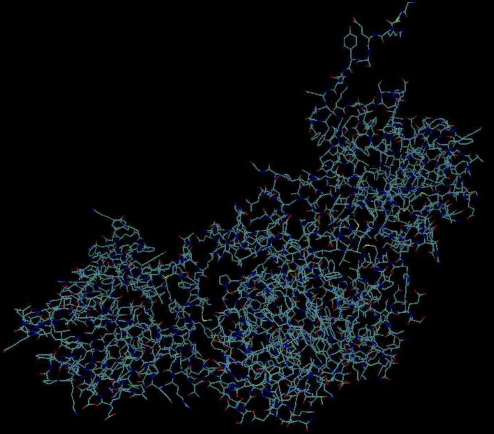

# Introducation

The introduction of AlphaFold 2 has spurred a revolution in modelling the structure of proteins and their interactions, enabling a huge range of applications in protein modelling and design. 

Here we describe our AlphaFold 3 model with a substantially updated diffusion-based architecture that is capable of predicting the joint structure of complexes including proteins, nucleic acids, small molecules, ions and modified residues. 

The new AlphaFold model demonstrates substantially improved accuracy over many previous specialized tools: far greater accuracy for protein–ligand interactions compared with state-of-the-art docking tools, much higher accuracy for protein–nucleic acid interactions compared with nucleic-acid-specific predictors and substantially higher antibody–antigen prediction accuracy compared with AlphaFold-Multimer. Together, these results show that high-accuracy modelling across biomolecular space is possible within a single unified deep-learning framework.


## Example

The following input JSON file named `alphafold_input.json`:

```
{
  "name": "2PV7",
  "sequences": [
    {
      "protein": {
        "id": ["A", "B"],
        "sequence": "GMRESYANENQFGFKTINSDIHKIVIVGGYGKLGGLFARYLRASGYPISILDREDWAVAESILANADVVIVSVPINLTLETIERLKPYLTENMLLADLTSVKREPLAKMLEVHTGAVLGLHPMFGADIASMAKQVVVRCDGRFPERYEWLLEQIQIWGAKIYQTNATEHDHNMTYIQALRHFSTFANGLHLSKQPINLANLLALSSPIYRLELAMIGRLFAQDAELYADIIMDKSENLAVIETLKQTYDEALTFFENNDRQGFIDAFHKVRDWFGDYSEQFLKESRQLLQQANDLKQG"
      }
    }
  ],
  "modelSeeds": [1],
  "dialect": "alphafold3",
  "version": 1
}
```

## Submit Jobs

**af3.slurm**
```
#!/bin/bash
#SBATCH --job-name=af3
#SBATCH --partition=sfscai
#SBATCH -N 1
#SBATCH --ntasks-per-node=10
#SBATCH --gres=gpu:1
#SBATCH --time=10:00:00
#SBATCH --output=%j.out
#SBATCH --error=%j.err

module load alphafold/3
run_af3 $HOME/af_input/alphafold_input.json $HOME/af_output
```

```
sbatch af3.slurm
```

## Result

```
[hpc@hpclogin alphafold3]$ tree  af_output
af_output
+-- 2pv7
    +-- 2pv7_confidences.json
    +-- 2pv7_data.json
    +-- 2pv7_model.cif
    +-- 2pv7_summary_confidences.json
    +-- ranking_scores.csv
    +-- seed-1_sample-0
    ¦   +-- confidences.json
    ¦   +-- model.cif
    ¦   +-- summary_confidences.json
    +-- seed-1_sample-1
    ¦   +-- confidences.json
    ¦   +-- model.cif
    ¦   +-- summary_confidences.json
    +-- seed-1_sample-2
    ¦   +-- confidences.json
    ¦   +-- model.cif
    ¦   +-- summary_confidences.json
    +-- seed-1_sample-3
    ¦   +-- confidences.json
    ¦   +-- model.cif
    ¦   +-- summary_confidences.json
    +-- seed-1_sample-4
    ¦   +-- confidences.json
    ¦   +-- model.cif
    ¦   +-- summary_confidences.json
    +-- TERMS_OF_USE.md

6 directories, 21 files
```

**af_output/2pv7_model.cif**

{: style="width:80%;style="height:80%" .center}
