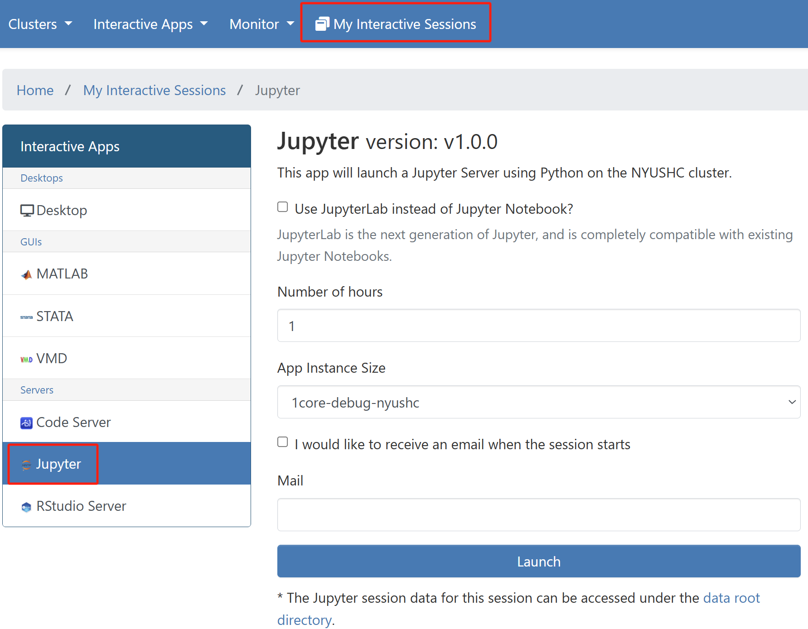
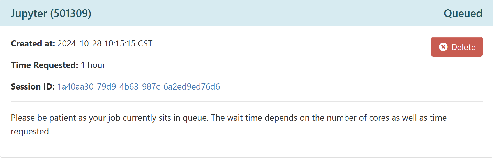
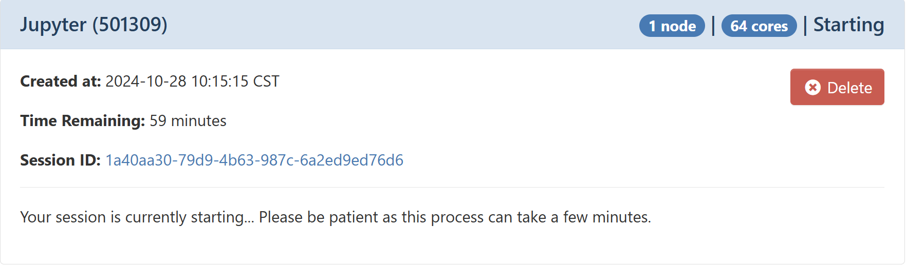
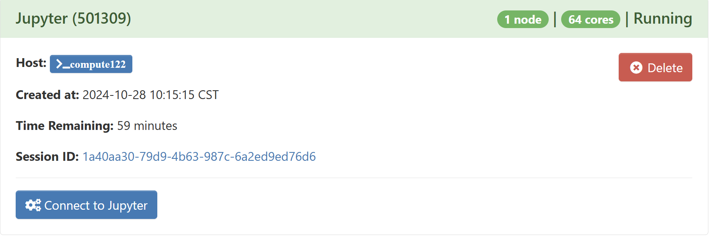
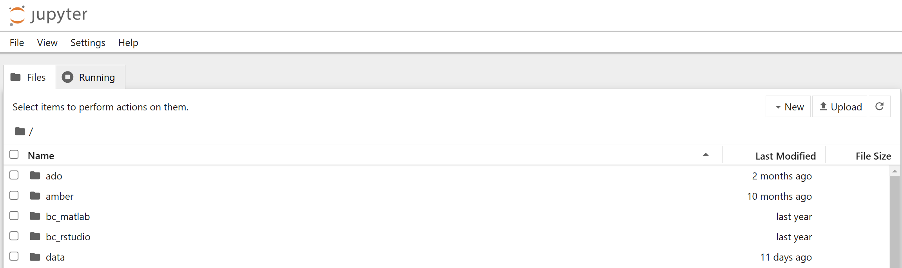
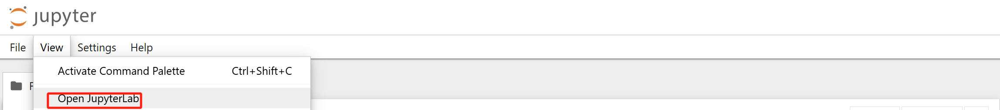
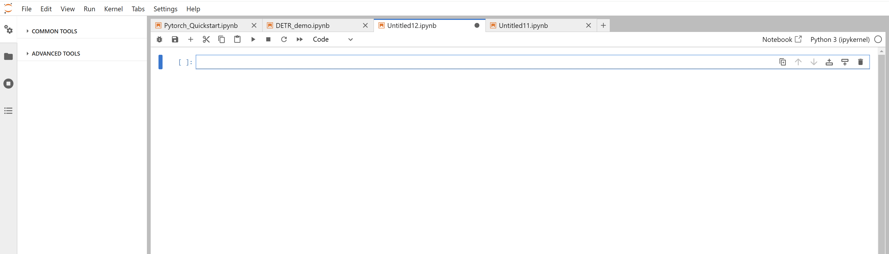

## Introduction

JupyterLab is the latest web-based interactive development environment for notebooks, code, and data. 
Its flexible interface allows users to configure and arrange workflows in data science, scientific computing, computational journalism, and machine learning. 
A modular design invites extensions to expand and enrich functionality.

## Version

| Cluster | Version   | Module                    |
|:--------|:----------|:-------------------------:|
| nyushc  | 7.0.6     | jupyter/7.0.6-cuda-11.4.3 |

## Launch Jupyter

Setup an [Open OnDemand (OOD)](https://ood.shanghai.nyu.edu) portal web server.

To start the session, please go to `My Interactive Apps` in the top menu bar and select `Jupyter` in the left-hand panel.

{: style="width:90%;" .center}

Allocate appropriate resources and click `Launch`.

An info card for the RStudio Server will be added to `My Interactive Sessions`, and during start,
it will change its state from `Queued` to `Starting` to `Running`. Depending on the app, resources allocated and
current cluster usage, this will take a couple of seconds.


{: style="width:90%;" .center}


{: style="width:90%;" .center}


{: style="width:90%;" .center}


When in the final state (`Running`), one can directly connect to the JupyterLab
to get an interactive session by clicking `Connect to Jupyter`:

{: style="width:90%;" .center}

Open JupyterLab

{: style="width:90%;" .center}

{: style="width:90%;" .center}

## Configure iPython Kernel

Install iPython Kernel
```
module load miniconda3
source activate my_env
pip install ipykernel 
```

Copy the template files to your `~/.local/share/jupyter/kernels` directory.
```
mkdir -p ~/.local/share/jupyter/kernels
cd ~/.local/share/jupyter/kernels
cp -R /gpfsnyu/spack/share/kernel_template ./my_env # this should be the name of your conda env
cd ./my_env 

ls
#kernel.json  logo-32x32.png  logo-64x64.png  python
```

To set the conda environment, edit the file named 'python' in ~/.local/share/jupyter/kernels/my_env/. 

Edit the default kernel.json file by setting PYTHON_LOCATION and KERNEL_DISPLAY_NAME using a text editor like vi.

```
{
 "argv": [
  "PYTHON_LOCATION",
  "-m",
  "ipykernel_launcher",
  "-f",
  "{connection_file}"
 ],
 "display_name": "KERNEL_DISPLAY_NAME",
 "language": "python"
}
```
to
```
{
 "argv": [
  "/gpfsnyu/home/<Your NetID>/.local/share/jupyter/kernels/my_env/python",
  "-m",
  "ipykernel_launcher",
  "-f",
  "{connection_file}"
 ],
 "display_name": "my_env [~/.conda/envs/my_env]",
 "language": "python"
}
```
