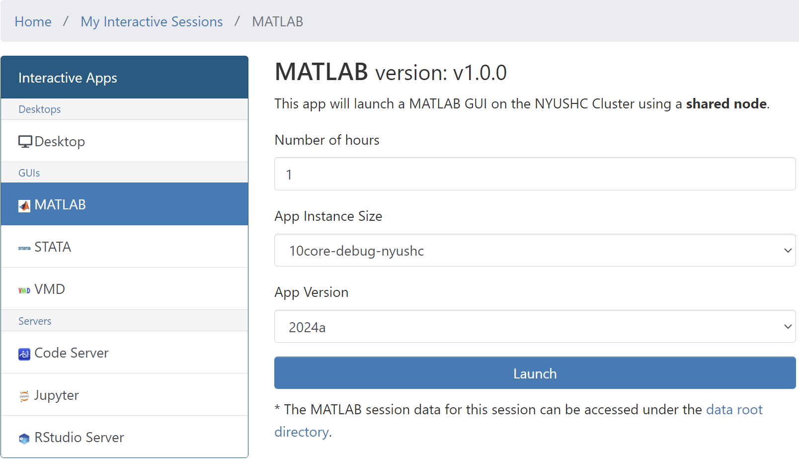
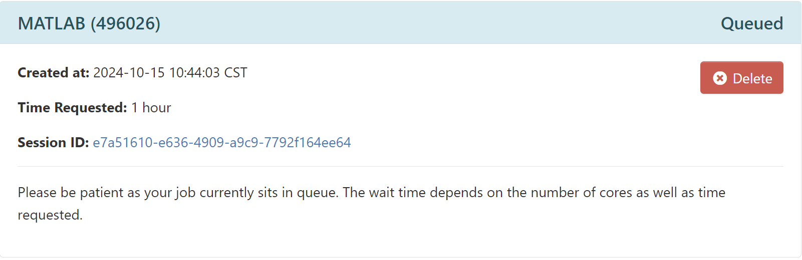
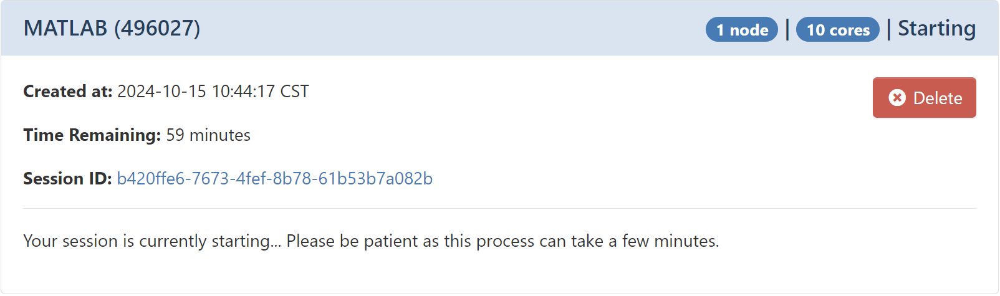
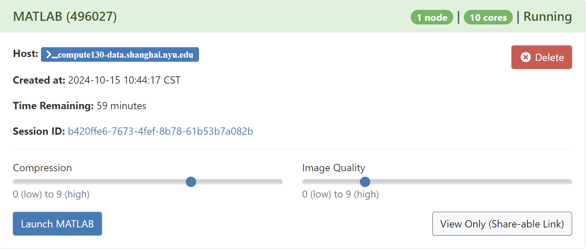
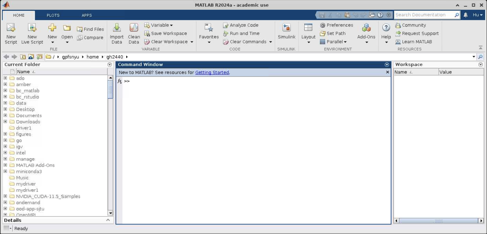

# How-To: Use Matlab

MATLAB is a proprietary multi-paradigm programming language and numeric computing environment developed by MathWorks. MATLAB allows matrix manipulations, plotting of functions and data, implementation of algorithms, creation of user interfaces, and interfacing with programs written in other languages.

## Version

| Cluster | Version| Module       | 
|:--------|:-------|:------------:|
| nyushc  | 2022a  | matlab/2022a |
| nyushc  | 2022b  | matlab/2022b |
| nyushc  | 2023a  | matlab/2023a |
| nyushc  | 2023b  | matlab/2023b |
| nyushc  | 2025a  | matlab/2024a |

## Run Matlab via Shell

```console
[hpc@hpclogin ~]$ srun --pty /bin/bash
[hpc@compute130 ~]$ module avail matlab

------------------------------------------------------------------------------------------------- /gpfsnyu/spack/modulefiles --------------------------------------------------------------------------------------------------
   matlab/2022a    matlab/2022b    matlab/2023a    matlab/2023b    matlab/2024a (D)

  Where:
   D:  Default Module
[---]

[hpc@compute130 ~]$ module load matlab/2024a 
[hpc@compute130 ~]$ matlab -nosplash -nodisplay -nojvm
                                                              < M A T L A B (R) >
                                                    Copyright 1984-2024 The MathWorks, Inc.
                                                   R2024a (24.1.0.2537033) 64-bit (glnxa64)
                                                               February 21, 2024
>> ver 
--------------------------------------------------------------------------------------------
MATLAB Version: 24.1.0.2537033 (R2024a)
MATLAB License Number: 618777
Operating System: Linux 4.18.0-372.9.1.el8.x86_64 #1 SMP Fri Apr 15 22:12:19 EDT 2022 x86_64
Java Version: Java is not enabled
--------------------------------------------------------------------------------------------
MATLAB                                                Version 24.1        (R2024a)
Simulink                                              Version 24.1        (R2024a)
5G Toolbox                                            Version 24.1        (R2024a)
AUTOSAR Blockset                                      Version 24.1        (R2024a)
Aerospace Blockset                                    Version 24.1        (R2024a)
Aerospace Toolbox                                     Version 24.1        (R2024a)
Antenna Toolbox                                       Version 24.1        (R2024a)
Audio Toolbox                                         Version 24.1        (R2024a)
Automated Driving Toolbox                             Version 24.1        (R2024a)
Bioinformatics Toolbox                                Version 24.1        (R2024a)
Bluetooth Toolbox                                     Version 24.1        (R2024a)
C2000 Microcontroller Blockset                        Version 24.1        (R2024a)
Communications Toolbox                                Version 24.1        (R2024a)
Computer Vision Toolbox                               Version 24.1        (R2024a)
Control System Toolbox                                Version 24.1        (R2024a)
Curve Fitting Toolbox                                 Version 24.1        (R2024a)
DDS Blockset                                          Version 24.1        (R2024a)
DSP HDL Toolbox                                       Version 24.1        (R2024a)
DSP System Toolbox                                    Version 24.1        (R2024a)
Database Toolbox                                      Version 24.1        (R2024a)
Datafeed Toolbox                                      Version 24.1        (R2024a)
Deep Learning Toolbox                                 Version 24.1        (R2024a)
Econometrics Toolbox                                  Version 24.1        (R2024a)
Embedded Coder                                        Version 24.1        (R2024a)
Filter Design HDL Coder                               Version 24.1        (R2024a)
Financial Instruments Toolbox                         Version 24.1        (R2024a)
Financial Toolbox                                     Version 24.1        (R2024a)
Fixed-Point Designer                                  Version 24.1        (R2024a)
Fuzzy Logic Toolbox                                   Version 24.1        (R2024a)
GPU Coder                                             Version 24.1        (R2024a)
Global Optimization Toolbox                           Version 24.1        (R2024a)
HDL Coder                                             Version 24.1        (R2024a)
HDL Verifier                                          Version 24.1        (R2024a)
Image Acquisition Toolbox                             Version 24.1        (R2024a)
Image Processing Toolbox                              Version 24.1        (R2024a)
Industrial Communication Toolbox                      Version 24.1        (R2024a)
Instrument Control Toolbox                            Version 24.1        (R2024a)
LTE Toolbox                                           Version 24.1        (R2024a)
Lidar Toolbox                                         Version 24.1        (R2024a)
MATLAB Coder                                          Version 24.1        (R2024a)
MATLAB Report Generator                               Version 24.1        (R2024a)
MATLAB Test                                           Version 24.1        (R2024a)
Mapping Toolbox                                       Version 24.1        (R2024a)
Medical Imaging Toolbox                               Version 24.1        (R2024a)
Mixed-Signal Blockset                                 Version 24.1        (R2024a)
Model Predictive Control Toolbox                      Version 24.1        (R2024a)
Motor Control Blockset                                Version 24.1        (R2024a)
Navigation Toolbox                                    Version 24.1        (R2024a)
Optimization Toolbox                                  Version 24.1        (R2024a)
Parallel Computing Toolbox                            Version 24.1        (R2024a)
Partial Differential Equation Toolbox                 Version 24.1        (R2024a)
Phased Array System Toolbox                           Version 24.1        (R2024a)
Powertrain Blockset                                   Version 24.1        (R2024a)
Predictive Maintenance Toolbox                        Version 24.1        (R2024a)
RF Blockset                                           Version 24.1        (R2024a)
RF PCB Toolbox                                        Version 24.1        (R2024a)
RF Toolbox                                            Version 24.1        (R2024a)
ROS Toolbox                                           Version 24.1        (R2024a)
Radar Toolbox                                         Version 24.1        (R2024a)
Reinforcement Learning Toolbox                        Version 24.1        (R2024a)
Requirements Toolbox                                  Version 24.1        (R2024a)
Risk Management Toolbox                               Version 24.1        (R2024a)
Robotics System Toolbox                               Version 24.1        (R2024a)
Robust Control Toolbox                                Version 24.1        (R2024a)
Satellite Communications Toolbox                      Version 24.1        (R2024a)
Sensor Fusion and Tracking Toolbox                    Version 24.1        (R2024a)
SerDes Toolbox                                        Version 24.1        (R2024a)
Signal Integrity Toolbox                              Version 24.1        (R2024a)
Signal Processing Toolbox                             Version 24.1        (R2024a)
SimBiology                                            Version 24.1        (R2024a)
SimEvents                                             Version 24.1        (R2024a)
Simscape                                              Version 24.1        (R2024a)
Simscape Battery                                      Version 24.1        (R2024a)
Simscape Driveline                                    Version 24.1        (R2024a)
Simscape Electrical                                   Version 24.1        (R2024a)
Simscape Fluids                                       Version 24.1        (R2024a)
Simscape Multibody                                    Version 24.1        (R2024a)
Simulink 3D Animation                                 Version 24.1        (R2024a)
Simulink Check                                        Version 24.1        (R2024a)
Simulink Code Inspector                               Version 24.1        (R2024a)
Simulink Coder                                        Version 24.1        (R2024a)
Simulink Control Design                               Version 24.1        (R2024a)
Simulink Coverage                                     Version 24.1        (R2024a)
Simulink Design Optimization                          Version 24.1        (R2024a)
Simulink Design Verifier                              Version 24.1        (R2024a)
Simulink Desktop Real-Time                            Version 24.1        (R2024a)
Simulink Fault Analyzer                               Version 24.1        (R2024a)
Simulink PLC Coder                                    Version 24.1        (R2024a)
Simulink Real-Time                                    Version 24.1        (R2024a)
Simulink Report Generator                             Version 24.1        (R2024a)
Simulink Test                                         Version 24.1        (R2024a)
SoC Blockset                                          Version 24.1        (R2024a)
Stateflow                                             Version 24.1        (R2024a)
Statistics and Machine Learning Toolbox               Version 24.1        (R2024a)
Symbolic Math Toolbox                                 Version 24.1        (R2024a)
System Composer                                       Version 24.1        (R2024a)
System Identification Toolbox                         Version 24.1        (R2024a)
Text Analytics Toolbox                                Version 24.1        (R2024a)
UAV Toolbox                                           Version 24.1        (R2024a)
Vehicle Dynamics Blockset                             Version 24.1        (R2024a)
Vehicle Network Toolbox                               Version 24.1        (R2024a)
Vision HDL Toolbox                                    Version 24.1        (R2024a)
WLAN Toolbox                                          Version 24.1        (R2024a)
Wavelet Toolbox                                       Version 24.1        (R2024a)
Wireless HDL Toolbox                                  Version 24.1        (R2024a)
>> 
```

## Run Matlab via OOD

Setup an [Open OnDemand (OOD)](https://ood.shanghai.nyu.edu) portal web server.

To start the session, please go to `Interactive Apps` in the top menu bar and select `Code Server` or click `MATLAB` in the left-hand panel.

{: style="width:90%;" .center}

Allocate appropriate resources and click `Launch`.

An info card for the RStudio Server will be added to `My Interactive Sessions`, and during start,
it will change its state from `Queued` to `Starting` to `Running`. Depending on the app, resources allocated and
current cluster usage, this will take a couple of seconds.


{: style="width:90%;" .center}


{: style="width:90%;" .center}


{: style="width:90%;" .center}


When in the final state (`Running`), one can directly connect to the Matlab
to get an interactive session by clicking `Launch MATLAB`:

{: style="width:90%;" .center}
