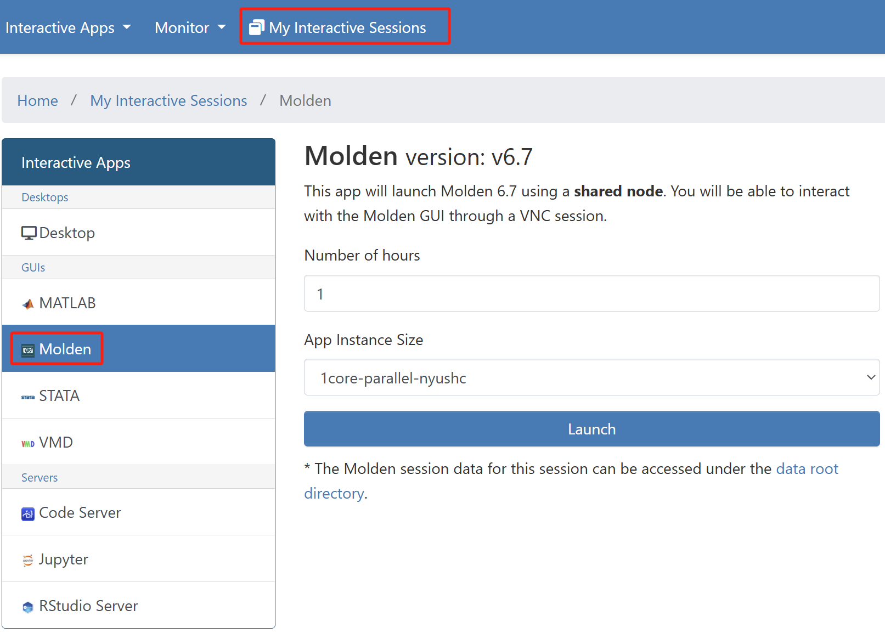
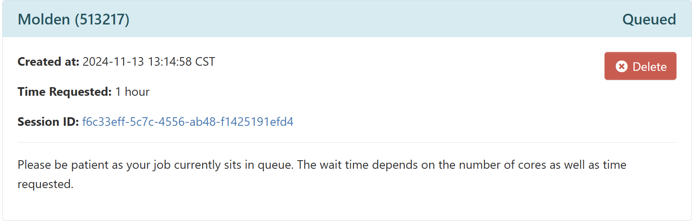
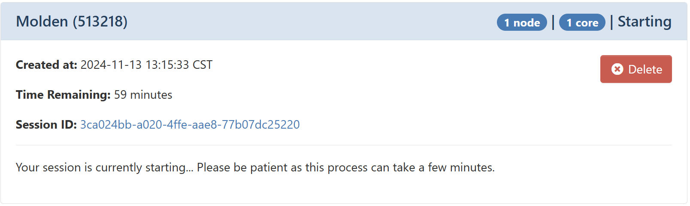
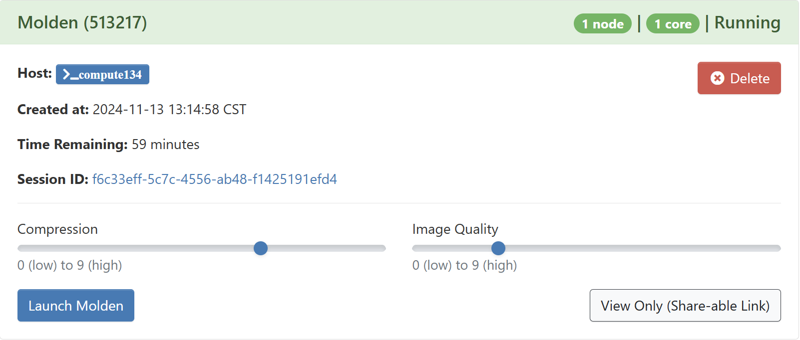
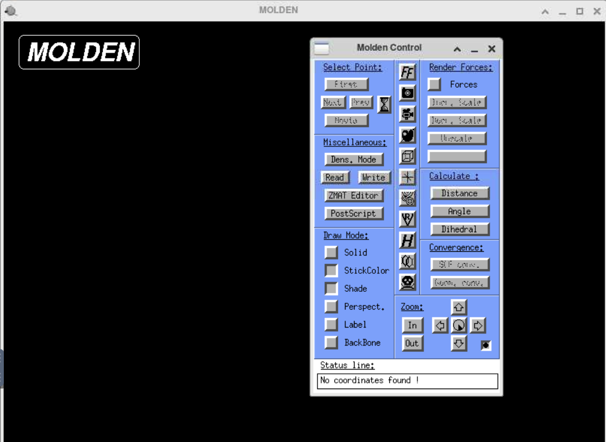
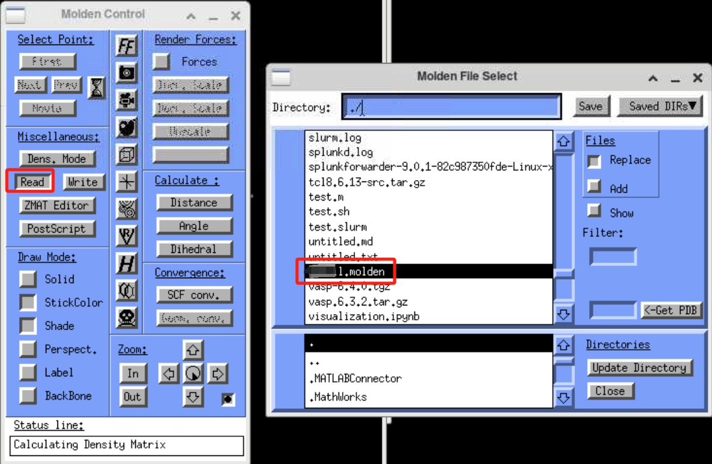
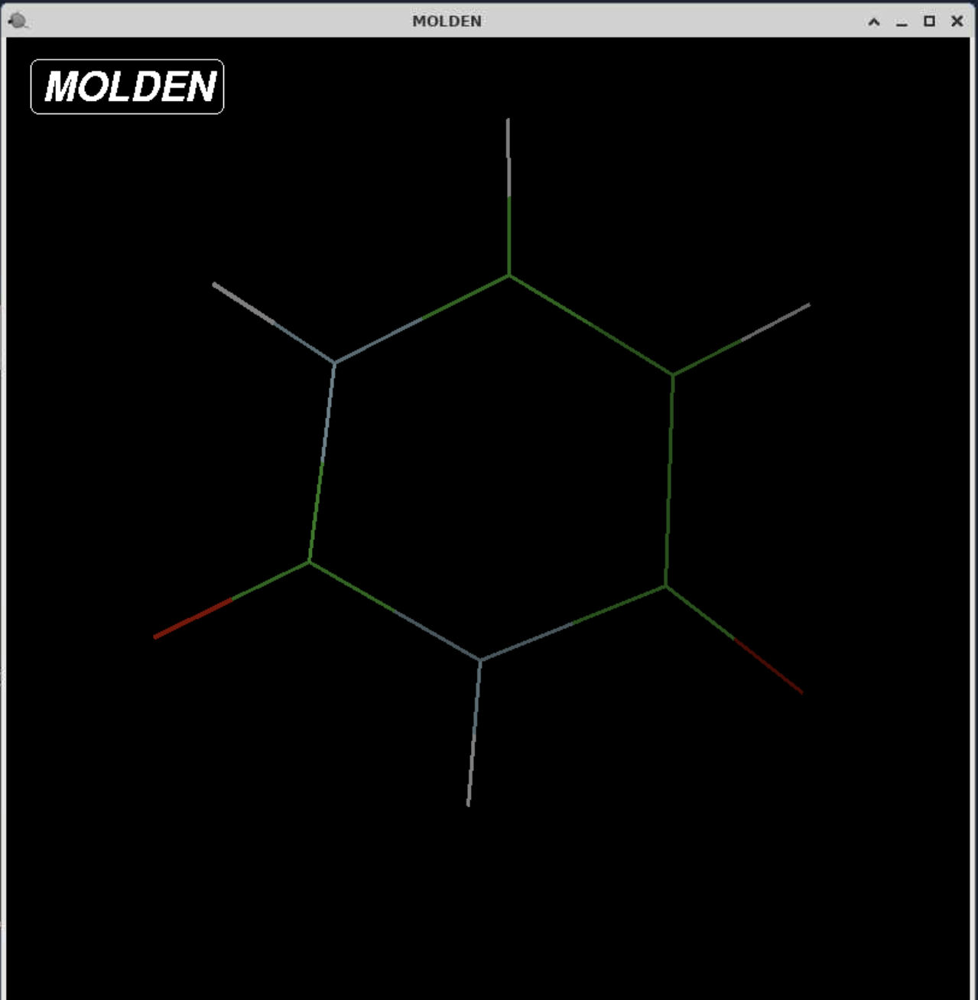

## Introduction
MOLDEN a pre- and post processing program of molecular and electronic structure.

## Version

| Cluster | Version For Code | Version For Code-Server  |
|:--------|:-----------------|:------------------------:|
| nyushc  | 6.7              | molden/6.7-gcc-8.5.0     |
| nyushc  | 6.6              | molden/6.6-gcc-8.5.0     |
| nyushc  | 6.5              | molden/6.5-gcc-8.5.0     |

## Launch MOLDEN

Setup an [Open OnDemand (OOD)](https://ood.shanghai.nyu.edu) portal web server.

To start the session, please go to `Interactive Apps` in the top menu bar and select `Molden` or click `Molden` in the left-hand panel.

{: style="width:90%;" .center}

Allocate appropriate resources and click `Launch`.

An info card for the Molden will be added to `My Interactive Sessions`, and during start,
it will change its state from `Queued` to `Starting` to `Running`. Depending on the app, resources allocated and
current cluster usage, this will take a couple of seconds.

{: style="width:90%;" .center}

{: style="width:90%;" .center}

{: style="width:90%;" .center}

When in the final state (`Running`), one can directly connect to the Molden
to get an interactive session by clicking `Launch Molden`:

{: style="width:90%;" .center}

## Load File

{: style="width:90%;" .center}

## Result

{: style="width:50%;height=50%" .center}
