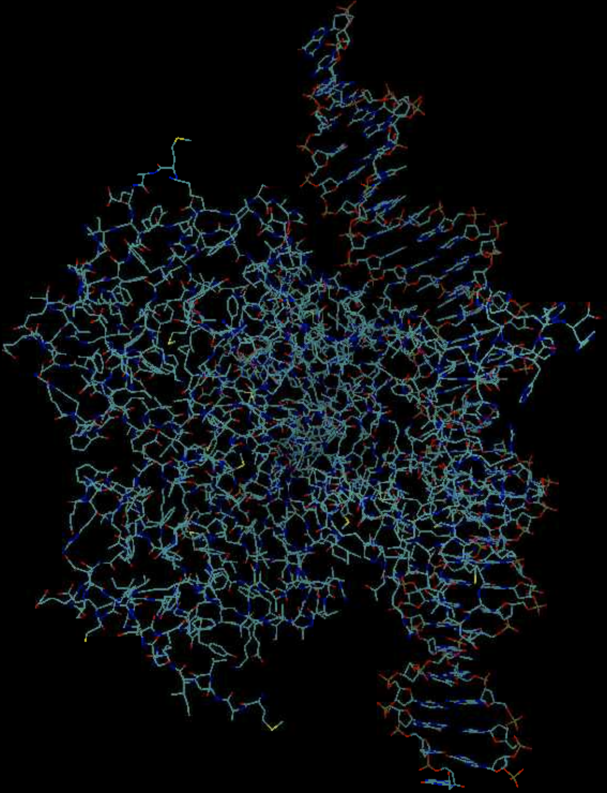

# Introducation

A trainable PyTorch reproduction of AlphaFold 3.

| Cluster | Version| Module         |
|:--------|:-------|:--------------:|
| nyushc  | 0.1.0  | protenix/0.1.0 |
| nyushc  | 0.4.6  | protenix/0.4.6 |

## Example
```
git clone https://github.com/bytedance/protenix.git 
cd ./protenix
[hpc@gpu190 protenix]$ tree examples/
examples/
├── 7pzb
│   └── msa
│       └── 1
│           ├── non_pairing.a3m
│           └── pairing.a3m
├── 7r6r
│   └── msa
│       └── 1
│           ├── non_pairing.a3m
│           └── pairing.a3m
├── 7wux
│   └── msa
│       ├── 1
│       │   ├── non_pairing.a3m
│       │   └── pairing.a3m
│       └── 2
│           ├── non_pairing.a3m
│           └── pairing.a3m
├── example.json
└── finetune_subset.txt

10 directories, 10 files
```

## Submit Inference Jobs

### v0.1.0

**Build protenix firstly**
```
wget https://github.com/bytedance/Protenix/archive/refs/tags/v0.1.0.tar.gz
tar xf v0.1.0.tar.gz
cd Protenix-0.1.0
module load protenix/0.1.0
pip install -e .
```

**protenix.slurm**
```
#!/bin/bash
#SBATCH --job-name=af3
#SBATCH --partition=sfscai
#SBATCH -N 1
#SBATCH --ntasks-per-node=6
#SBATCH --gres=gpu:1
#SBATCH --time=10:00:00
#SBATCH --output=%j.out
#SBATCH --error=%j.err

module load protenix
export LAYERNORM_TYPE=fast_layernorm

N_sample=5
N_step=200
N_cycle=10
seed=101
use_deepspeed_evo_attention=true
input_json_path="./examples/example.json"
load_checkpoint_path="/af3-dev/release_model/model_v1.pt"
dump_dir="./output"

cd ./protenix
python3 runner/inference.py \
--seeds ${seed} \
--load_checkpoint_path ${load_checkpoint_path} \
--dump_dir ${dump_dir} \
--input_json_path ${input_json_path} \
--use_deepspeed_evo_attention ${use_deepspeed_evo_attention} \
--model.N_cycle ${N_cycle} \
--sample_diffusion.N_sample ${N_sample} \
--sample_diffusion.N_step ${N_step}
```

### v0.4.6

#### Enter data directory
```
git clone https://github.com/bytedance/protenix.git 
cd ~/protenix
```

**protenix.slurm**
```
#!/bin/bash
#SBATCH --job-name=af3
#SBATCH --partition=sfscai
#SBATCH -N 1
#SBATCH --ntasks-per-node=6
#SBATCH --gres=gpu:1
#SBATCH --time=10:00:00
#SBATCH --output=%j.out
#SBATCH --error=%j.err

module load protenix/0.4.6
protenix predict --input examples/example.json --out_dir  ./output --seeds 101

```

```
sbatch protenix.slurm
```

## Protenix Prediction Result

### v0.1.0

**Example**: 7pzb_sample_0

**Protenix prediction confidence**: ./output/7pzb/seed_101/predictions/7pzb_summary_confidence_sample_0.json

**Protenix prediction**: ./output/7pzb/seed_101/predictions/7pzb_sample_0.cif 

{: style="width:80%;style="height:80%" .center}
