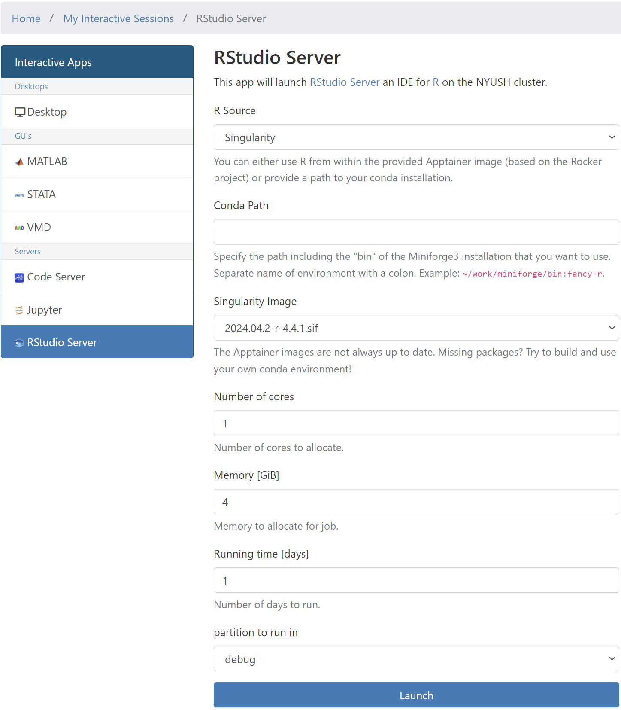
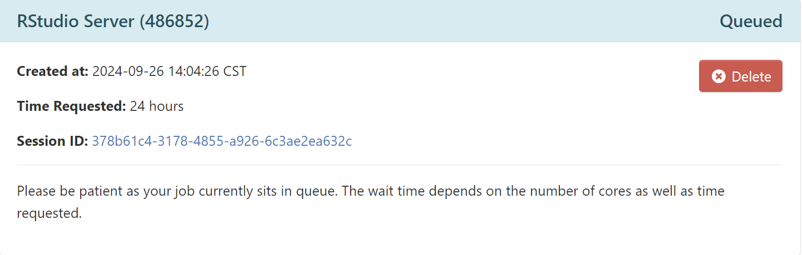
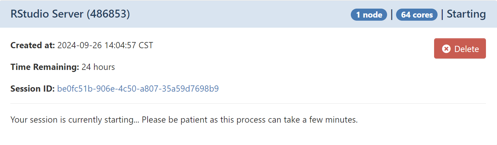
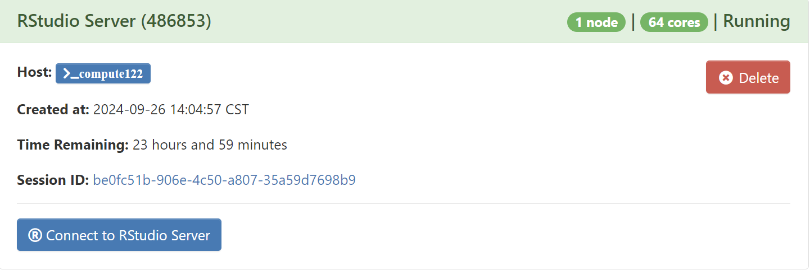
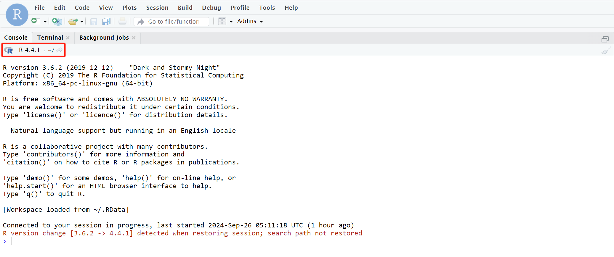

## Introduction
RStudio IDE (or RStudio) is an integrated development environment for [R](https://www.r-project.org/), a programming language for statistical computing and graphics.

## Version

| Version For R   | Version For RStudio      |
|:----------------|:------------------------:|
| 4.4.1           | 2024.04.2+764            |

## Launch RStudio

To start the session, please go to `Interactive Apps` in the top menu bar and select `RStudio Server` or click `RStudio Server` in the left-hand panel.

{: style="width:90%;" .center}

Allocate appropriate resources and click `Launch`.

An info card for the RStudio Server will be added to `My Interactive Sessions`, and during start,
it will change its state from `Queued` to `Starting` to `Running`. Depending on the app, resources allocated and
current cluster usage, this will take a couple of seconds.

{: style="width:90%;" .center}

{: style="width:90%;" .center}

{: style="width:90%;" .center}

When in the final state (`Running`), one can directly connect to the RStudio Server
to get an interactive session by clicking `Connect to RStudio Server`:

{: style="width:90%;" .center}

