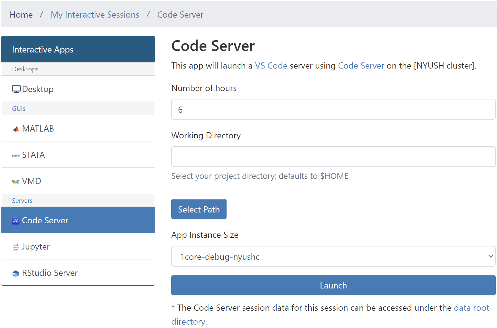
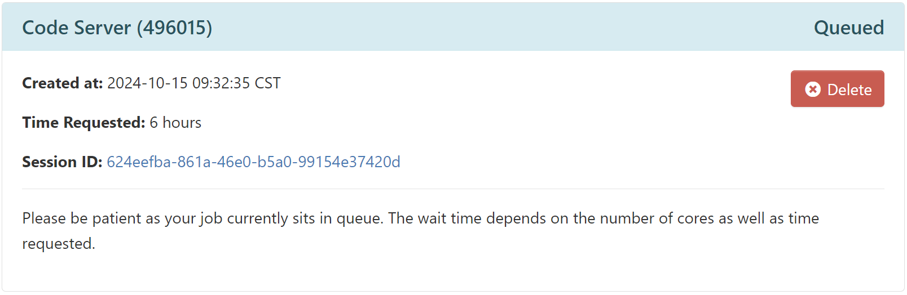
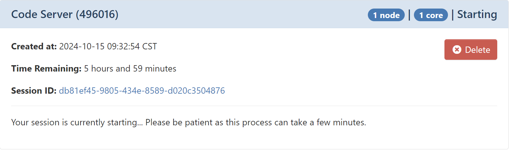
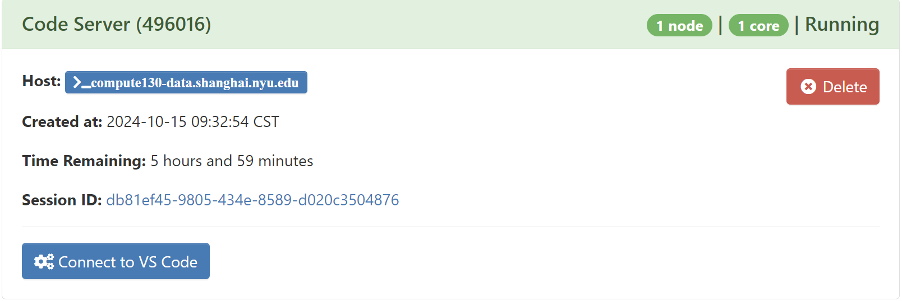
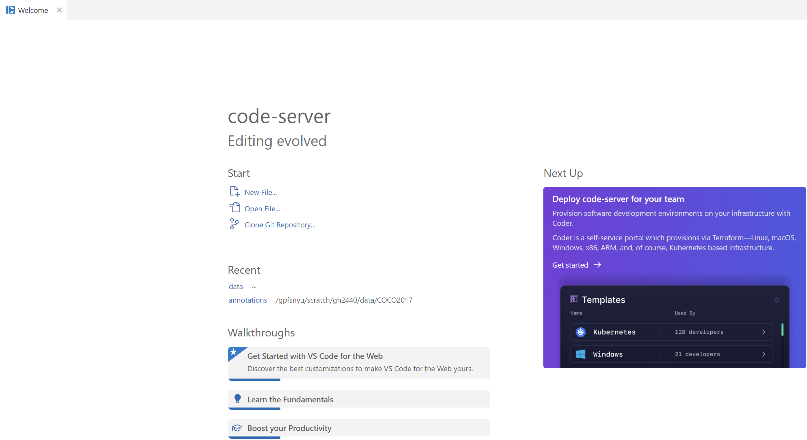

## Introduction
Visual Studio Code is a code editor redefined and optimized for building and debugging modern web and cloud applications. 

## Version

| Version For Code | Version For Code-Server  |
|:-----------------|:------------------------:|
| 1.76.1           | v4.11.0                  |

## Launch VS Code

Setup an [Open OnDemand (OOD)](https://ood.shanghai.nyu.edu) portal web server.

To start the session, please go to `Interactive Apps` in the top menu bar and select `Code Server` or click `Code Server` in the left-hand panel.

{: style="width:90%;" .center}

Allocate appropriate resources and click `Launch`.

An info card for the RStudio Server will be added to `My Interactive Sessions`, and during start,
it will change its state from `Queued` to `Starting` to `Running`. Depending on the app, resources allocated and
current cluster usage, this will take a couple of seconds.

{: style="width:90%;" .center}

{: style="width:90%;" .center}

{: style="width:90%;" .center}

When in the final state (`Running`), one can directly connect to the Code Server
to get an interactive session by clicking `Connect to VS Code`:

{: style="width:90%;" .center}

